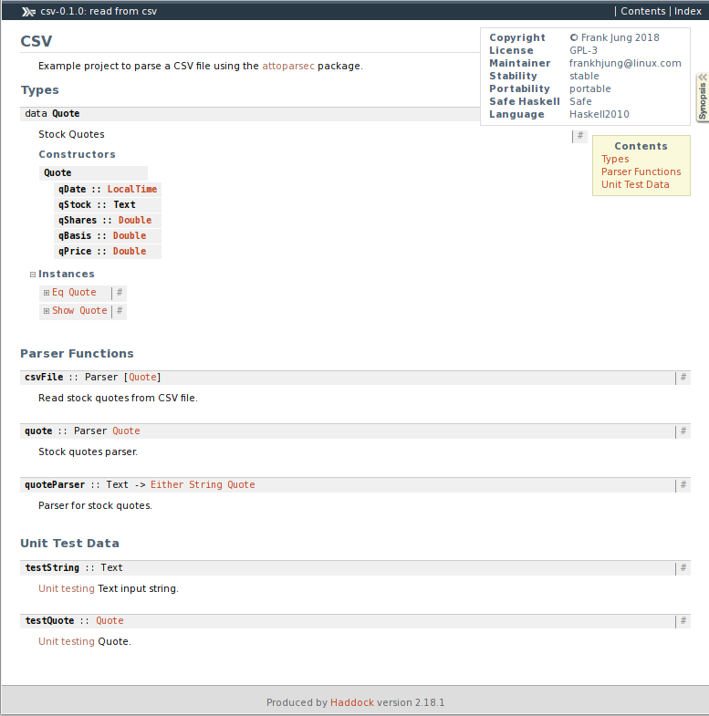

# Haskell Parse CSV using attoparsec

Example project to parse a CSV file. If you need a full-blown CSV parser I
suggest the [cassava](http://hackage.haskell.org/package/cassava) package. This
project is more as an example project to learn features of the
[attoparsec](http://hackage.haskell.org/package/attoparsec) package.

To get started read [Haskell Financial Data Modeling and Predictive Analytics by
Pavel Ryzhov](https://www.packtpub.com/big-data-and-business-intelligence/haskell-financial-data-modeling-and-predictive-analytics).


## Build

The project can uses [Cabal](#cabal) and/or [Stack](#stack) to build.


### Cabal

Another way to build this project is with Cabal.
```bash
cabal configure
cabal build
```

You can then use GNU make to build with:
```bash
make -f cabal.mk [target]
```


### Stack

Initialise project and dependencies with:
```bash
stack update
stack build
```

You can then use GNU make to build with:
```bash
make -f stack.mk [target]
```


## Haddock Documentation

To build the [Haddock](http://hackage.haskell.org/package/haddock)
documentation, run

```bash
make doc
```

This produces HTML pages. Here is the synopsis page:



